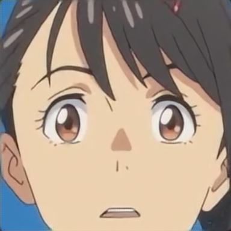

# Real-time Super Resolution

The goal of this project is to provide SISR models for realtime video supre-resolution w/o over-sharpening / over-smoothing.

## Benchmark
| Model       | Type              |  Input           | Output       | Device              | Latency (ms) |
|-------------|-------------------|------------------|--------------|---------------------|--------------|
| VCD v1 3x   | TF SavedModel     | 320x240          | 960x720      | Apple M1 Max        |        12.03 |
| anime v1 3x | TF SavedModel     | 640x360          | 1920x1080    | Apple M1 Max        |         8.01 |
| anime v1 3x | TF SavedModel     | 1280x720         | 3840x2160    | Apple M1 Max        |        32.31 |
| anime v1 3x | TfLite fp16       | 640x360          | 1920x1080    | SD 8Gen3 Adreno 750 |        20.05 |

## VCD V1 3x
Trained with compressed images

## Anime V1 3X

### Demo Video

